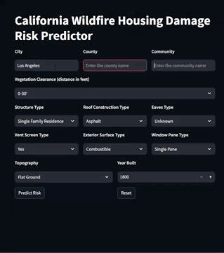

# California wildfire-prediction Web Application
A Machine learning based web application that predictst the Wildfire damage risk levels for residential structures in California, helping homeowners make informed decisions about the fire prevention and mitigation strategies.

## Demo

## Table of Contents

- [Introduction](#introduction)
- [Dataset Source](#dataset-source)
- [Dataset Contents and Structure](#dataset-contents-and-structure)
- [Data Insights & Analysis](#dashboard-insights)
- [Overview](#sales-overview)
- [Best Performaning Model](#key-performance-indicators-kpis)
- [Recommendations](#recommendations)
- [Features](#features)
- [License](#license)

## Introduction
This project analyzes historical California wildfire damage data to create a predictive model that assesses potential structural damage risks. The system considers multiple factors including vegetation clearance, building materials, topography, and historical damage patterns.

## Dataset Source
The dataset combines California wildfire incident records with detailed structural assessments of damaged properties, sourced from CAL FIRE and local county assessor offices. 
- [Dataset Link](https://data.ca.gov/dataset/cal-fire-damage-inspection-dins-data/resource/b8aeb030-140d-43d2-aa29-1a80862e3d62)